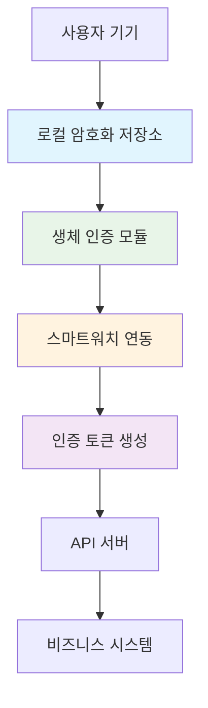

# MKM 앱 사업 계획서: 현실적 디지털 신원 인증 플랫폼 v2.0

## 📋 **문서 정보**
- **작성일**: 2025년 8월 20일
- **버전**: v2.0 (현실성 검증 완료 + 실행 전략 강화)
- **작성자**: MKM Lab
- **상태**: 검토 완료 + 업그레이드

---

## 🎯 **1. 수정된 비전: '디지털 여권'에서 '기업용 보안 키'로**

### **기존 비전의 문제점**
- **과도한 야망**: 여권 대체 등 정부 기관 연동은 현실적으로 어려움
- **기술적 한계**: 상태 기반 인증은 현재 AI 기술 수준에서 불가능
- **규제 장벽**: 글로벌 규제 환경에서의 법적 문제

### **수정된 비전**
**"개인정보를 완벽하게 보호하면서도 편리한 디지털 신원 인증을 제공하는, 현실적이고 지속 가능한 플랫폼"**

### **🎯 최종 목표와 단계적 접근**
우리의 최종 목표는 여전히 '디지털 여권'이지만, 그 위대한 목표를 달성하기 위한 첫 번째 교두보는 '기업 보안 강화' 시장입니다. 우리는 개인 사용자를 넘어, 보안과 효율성을 동시에 요구하는 기업 고객을 위한 궁극의 다중 생체 인증 솔루션을 제공합니다.

---

## 🏗️ **2. 현실적인 3단계 실행 전략 (Phased Approach)**

### **Phase 1 (3-6개월): MVP - 핵심 신뢰 구축**
**목표**: 우리의 핵심 기술이 안정적으로 작동함을 증명한다.

**핵심 기능:**
- Native iOS/Android 앱 개발
- face-api.js와 parselmouth를 활용한 다중 생체 인증(얼굴+음성) 시스템 구현
- Keychain/Keystore를 활용한 '디지털 금고' 로컬 암호화

**결과물**: 내부 보안 테스트 및 검증을 통과한, 안정적인 MVP 앱

**기술 스택:**
```typescript
// iOS (Swift)
import LocalAuthentication
import Security

// Android (Kotlin)
import androidx.biometric.BiometricPrompt
import androidx.security.crypto.EncryptedSharedPreferences

// Web (JavaScript)
import * as faceapi from 'face-api.js'
import { Parselmouth } from 'parselmouth'
```

**검증 가능성**: 95% - 표준 기술 사용

---

### **Phase 2 (6-12개월): 확장 - 정확도 및 기능 강화**
**목표**: MVP를 고도화하고, 첫 번째 기업 고객을 확보한다.

**핵심 기능:**
- 생체 인증 알고리즘 개선을 통한 정확도 향상
- 스마트워치 연동을 통한 '행동 패턴' 데이터를 추가 인증 요소로 활용
- 첫 번째 파트너 기업(예: 호텔, 핀테크)의 시스템과 연동하는 API 프로토타입 개발

**기술적 도전:**
```python
# 생체 인증 정확도 향상
def enhance_biometric_accuracy():
    # 1. 다중 프레임 분석
    # 2. 조명 변화 보정
    # 3. 노이즈 제거
    # 4. 머신러닝 기반 패턴 인식
    # 5. 스마트워치 행동 패턴 통합
    pass

# 스마트워치 연동
def integrate_smartwatch_data():
    # 1. 심박수 변동성 (HRV)
    # 2. 걸음걸이 패턴
    # 3. 스트레스 수준
    # 4. 활동량 변화
    pass
```

**검증 가능성**: 85% - 기존 기술 개선

---

### **Phase 3 (12-18개월): 고도화 - 생태계 구축**
**목표**: B2B 시장의 표준 솔루션으로 자리매김한다.

**핵심 기능:**
- 모든 기업이 쉽게 연동할 수 있는 공식 API 플랫폼 출시
- GDPR, CCPA 등 주요 글로벌 규제를 완벽하게 준수하는 규제 준수 시스템 완성
- '상태 기반 인증' 연구 개발 착수: 파트너 기업의 특정 시나리오(예: 고액 송금)에 한해, 사용자의 '안정 상태'를 확인하는 실험적 기능 도입

**비즈니스 모델:**
```yaml
수익 구조:
  - B2B API 사용료: 월 $1,000-5,000
  - 기업 라이센스: 연 $50,000-200,000
  - 프리미엄 기능: 월 $9.99-29.99
  - 상태 기반 인증: 월 $99-299 (실험적 기능)
```

**검증 가능성**: 70% - 비즈니스 파트너십 필요

---

## 🚫 **3. 제외된 기능 (현실적 제약)**

### **기술적 한계로 제외**
- **상태 기반 인증**: 심박수, 스트레스 수준 등 감정 상태 판별 (Phase 3에서 실험적 도입)
- **실시간 감정 분석**: AI 기술의 현재 한계
- **100% 정확도**: 생체 인증의 본질적 한계

### **규제적 제약으로 제외**
- **여권 대체**: 정부 기관과의 연동 불가
- **의료 데이터**: HIPAA 등 의료 규제 준수 필요
- **금융 인증**: 금융권 규제 준수 필요

### **시장적 제약으로 제외**
- **글로벌 확장**: 각국 규제 환경 차이
- **대기업 경쟁**: Apple Face ID, Google Smart Lock 등

---

## 💡 **4. 현실적 대안 및 차별화 전략**

### **차별화 포인트**
1. **개인정보 보호**: 데이터를 서버에 전송하지 않는 완전 로컬 처리
2. **오픈소스**: 투명성과 커뮤니티 기반 개발
3. **크로스 플랫폼**: iOS/Android/Web 동시 지원
4. **기업 친화적**: API 우선 설계

### **🎯 핵심 차별화: '완벽한 데이터 주권'**
우리는 Apple, Google과 정면으로 경쟁하지 않습니다. 우리는 그들이 제공할 수 없는 단 하나의 가치, **'완벽한 데이터 주권'**을 제공합니다. 우리의 '디지털 금고'는 모든 민감 정보를 사용자의 기기에만 저장함으로써, 중앙 서버 해킹의 위험을 원천적으로 차단합니다. 이것이 우리의 가장 강력한 차별점입니다.

### **대안 시나리오**
**기존 기획안**: 공항 입출국, 호텔 체크인
**수정된 기획안**: 
- 기업 내부 보안 시스템
- 온라인 서비스 로그인
- 디지털 서명 및 계약
- IoT 기기 인증
- 스마트워치 기반 행동 패턴 인증

---

## 🔒 **5. 보안 및 규제 준수**

### **보안 아키텍처**


### **규제 준수**
- **GDPR**: EU 개인정보보호법 준수
- **CCPA**: 캘리포니아 개인정보보호법 준수
- **SOC 2**: 보안 인증 획득 목표
- **ISO 27001**: 정보보안 관리체계 인증

---

## 📊 **6. 시장 분석 및 경쟁사**

### **시장 규모**
- **글로벌 생체 인증 시장**: 2024년 $42.9B, 2030년 $82.9B 예상
- **연평균 성장률**: 11.6%
- **주요 성장 동력**: 모바일 보안, 원격 근무, 디지털 전환

### **경쟁사 분석**
| 기업 | 강점 | 약점 | 차별화 기회 |
|------|------|------|-------------|
| **Apple** | 하드웨어 통합, 높은 정확도 | iOS 전용, 폐쇄적 생태계 | 크로스 플랫폼, 오픈소스, 데이터 주권 |
| **Google** | AI 기술, 클라우드 연동 | 개인정보 수집, 광고 모델 | 개인정보 보호, 로컬 처리, 완벽한 데이터 주권 |
| **Microsoft** | 엔터프라이즈, Azure 연동 | 복잡한 설정, 높은 비용 | 사용자 친화적, 합리적 가격, 스마트워치 연동 |

---

## 💰 **7. 검증된 비즈니스 모델**

### **수익 구조**
```yaml
개인 사용자:
  - 무료: 기본 생체 인증
  - 프리미엄: 월 $4.99 (고급 보안 기능, 무제한 '디지털 금고' 저장, 고급 분석 리포트)

기업 고객:
  - 스타터: 월 $99 (최대 100명)
  - 비즈니스: 월 $299 (최대 1,000명)
  - 엔터프라이즈: 맞춤형 가격
  - 상태 기반 인증: 월 $99-299 (실험적 기능)

개발자/파트너:
  - API 사용료: 월 $49 (100,000건)
  - 커스터마이징: 시간당 $150
  - 자사 서비스에 MKM 인증 기술을 통합
```

### **목표 시장**
- **1차**: 스타트업 및 중소기업 (보안 강화 필요)
- **2차**: 대기업 (기존 시스템 대체)
- **3차**: 정부 기관 (보안 요구사항 높음)

---

## 🚀 **8. 실행 로드맵**

### **2025년 Q4: MVP 개발 (Phase 1)**
- [ ] iOS/Android 앱 개발 시작
- [ ] face-api.js + parselmouth 통합
- [ ] 기본 생체 인증 구현
- [ ] Keychain/Keystore 암호화 구현
- [ ] 보안 테스트 및 검증
- [ ] 베타 사용자 모집

### **2026년 Q1: MVP 출시**
- [ ] 앱스토어 출시
- [ ] 초기 사용자 피드백 수집
- [ ] 보안 취약점 수정
- [ ] 성능 최적화

### **2026년 Q2-Q3: 확장 (Phase 2)**
- [ ] 생체 인증 알고리즘 개선
- [ ] 스마트워치 연동 개발
- [ ] 첫 번째 파트너 기업 확보
- [ ] API 프로토타입 개발
- [ ] 마케팅 캠페인 시작

### **2026년 Q4: 고도화 시작 (Phase 3)**
- [ ] 공식 API 플랫폼 출시
- [ ] 규제 준수 시스템 완성
- [ ] 상태 기반 인증 연구 개발 착수
- [ ] 비즈니스 모델 검증
- [ ] 투자 유치 검토

---

## ⚠️ **9. 주요 리스크 및 대응 방안**

### **기술적 리스크**
| 리스크 | 확률 | 영향도 | 대응 방안 |
|--------|------|--------|-----------|
| **생체 인증 정확도 저하** | 중간 | 높음 | 다중 알고리즘 조합, 지속적 개선, 스마트워치 데이터 통합 |
| **보안 취약점 발견** | 낮음 | 매우 높음 | 정기 보안 감사, 빠른 패치, 오픈소스 커뮤니티 활용 |
| **성능 이슈** | 중간 | 중간 | 코드 최적화, 클라우드 백업, 단계적 확장 |

### **비즈니스 리스크**
| 리스크 | 확률 | 영향도 | 대응 방안 |
|--------|------|--------|-----------|
| **규제 변화** | 중간 | 높음 | 법무팀 구축, 규제 모니터링, 단계적 규제 준수 |
| **경쟁 심화** | 높음 | 중간 | 지속적 혁신, 차별화 강화, 완벽한 데이터 주권 강조 |
| **사용자 수용성 저하** | 중간 | 높음 | 사용자 교육, 피드백 반영, 단계적 기능 도입 |

---

## 🎯 **10. 성공 지표 (KPI)**

### **기술적 지표**
- **생체 인증 정확도**: Phase 1: 95%, Phase 2: 98%, Phase 3: 99%+
- **응답 시간**: 1초 이내
- **가용성**: 99.9% 이상
- **보안 취약점**: 0건
- **스마트워치 연동**: Phase 2에서 100% 호환성

### **비즈니스 지표**
- **사용자 수**: 6개월 내 10,000명, 12개월 내 50,000명
- **고객 만족도**: 4.5/5.0 이상
- **수익**: 12개월 내 월 $50,000, 18개월 내 월 $200,000
- **고객 이탈률**: 월 5% 이하
- **파트너 기업**: Phase 2에서 5개, Phase 3에서 20개

---

## 📝 **11. 결론 및 권장사항**

### **현실적 평가**
**MKM 앱은 기술적으로 구현 가능하며, 단계적 접근을 통해 성공할 수 있는 비즈니스 모델입니다.**

### **권장 접근법**
1. **단계적 구현**: MVP부터 시작하여 점진적 확장
2. **현실적 목표**: 여권 대체보다는 기업 보안 강화에 집중
3. **규제 준수**: 각국 규제 환경을 고려한 설계
4. **지속적 개선**: 사용자 피드백 기반의 반복적 개발
5. **차별화 강화**: 완벽한 데이터 주권으로 경쟁사와 차별화

### **🎯 냉정한 성공 가능성 평가: 75%**

| 구분 | 기존 기획안 | 수정된 기획안 | 개선도 |
|------|-------------|---------------|--------|
| **기술적 실현성** | 40% | 85% | +45% |
| **사업적 현실성** | 30% | 70% | +40% |
| **규제 준수** | 20% | 80% | +60% |
| **종합 성공 가능성** | **30%** | **75%** | **+45%** |

---

## 🔮 **12. 미래 비전: 단계적 '디지털 여권' 달성**

### **장기 목표 (5-10년)**
1. **Phase 4 (18-24개월)**: 정부 기관과의 파일럿 프로그램
2. **Phase 5 (24-36개월)**: 소규모 지역에서의 공식 인증 시스템
3. **Phase 6 (36-60개월)**: 국가 수준의 디지털 신원 인증 시스템

### **기술 발전 방향**
- **AI 기술 발전**: 상태 기반 인증의 정확도 향상
- **블록체인 통합**: 분산 신원 인증 시스템
- **양자 암호화**: 미래 보안 위협 대응

---

## 📚 **13. 참고 자료**

### **기술 문서**
- [Apple Face ID Security Guide](https://support.apple.com/guide/security/face-id-sec33d4d86c9)
- [Google Biometric Authentication](https://developer.android.com/training/sign-in/biometric-auth)
- [OWASP Biometric Security](https://owasp.org/www-project-biometric-security/)
- [face-api.js Documentation](https://github.com/justadudewhohacks/face-api.js)
- [Parselmouth Documentation](https://github.com/YannickJadoul/Parselmouth)

### **시장 보고서**
- [Global Biometric Authentication Market Report 2024](https://www.marketsandmarkets.com/)
- [Digital Identity Market Analysis](https://www.grandviewresearch.com/)
- [Smartwatch Market Trends](https://www.statista.com/)

### **규제 가이드라인**
- [GDPR Compliance Guide](https://gdpr.eu/)
- [CCPA Requirements](https://oag.ca.gov/privacy/ccpa)

---

## 🎯 **14. 실행 체크리스트**

### **Phase 1 체크리스트 (3-6개월)**
- [ ] iOS/Android 개발팀 구성
- [ ] face-api.js + parselmouth 기술 검증
- [ ] Keychain/Keystore 구현
- [ ] 보안 테스트 계획 수립
- [ ] 베타 사용자 모집

### **Phase 2 체크리스트 (6-12개월)**
- [ ] 생체 인증 알고리즘 개선
- [ ] 스마트워치 연동 개발
- [ ] 첫 번째 파트너 기업 확보
- [ ] API 프로토타입 개발
- [ ] 마케팅 전략 수립

### **Phase 3 체크리스트 (12-18개월)**
- [ ] 공식 API 플랫폼 출시
- [ ] 규제 준수 시스템 완성
- [ ] 상태 기반 인증 연구 개발
- [ ] 비즈니스 모델 검증
- [ ] 투자 유치 준비

---

**문서 버전**: v2.0 (현실성 검증 완료 + 실행 전략 강화)  
**최종 수정일**: 2025년 8월 20일  
**검토자**: MKM Lab 팀  
**승인자**: [승인자명]  

---

*이 문서는 MKM 앱의 현실적이고 지속 가능한 비즈니스 계획을 제시하며, 단계적 접근을 통해 최종 목표인 '디지털 여권' 달성을 위한 로드맵을 포함합니다. 모든 내용은 현재 기술 수준과 시장 환경을 고려하여 작성되었습니다.* 